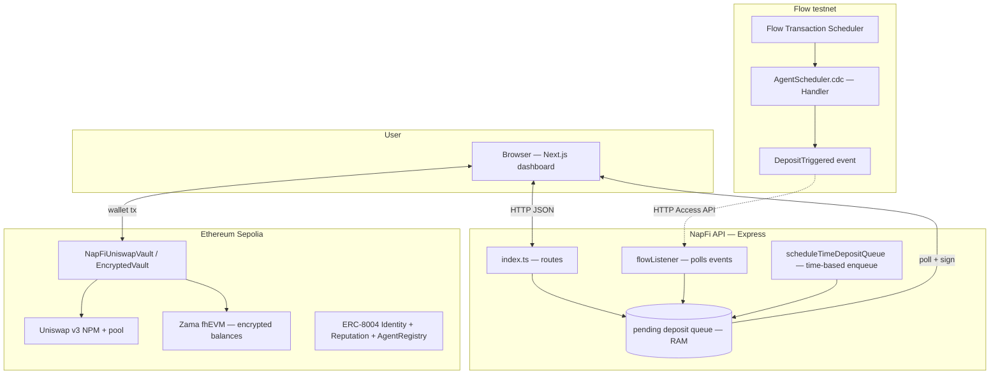
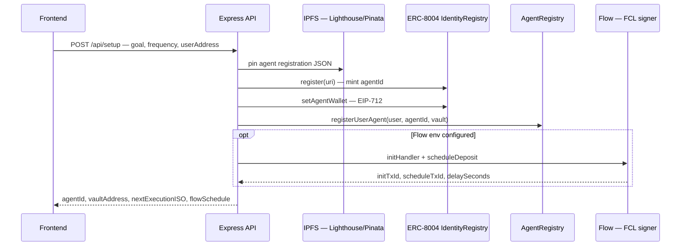
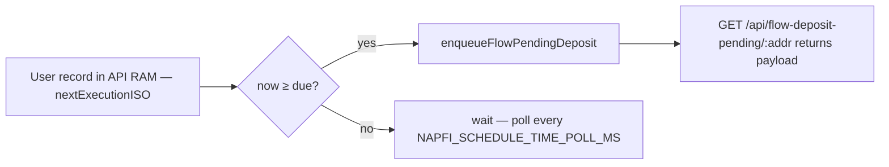
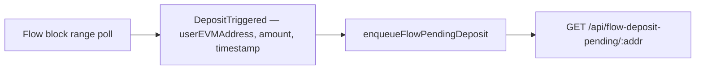
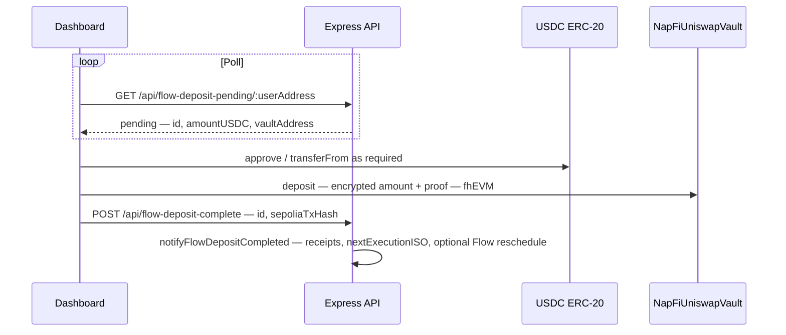
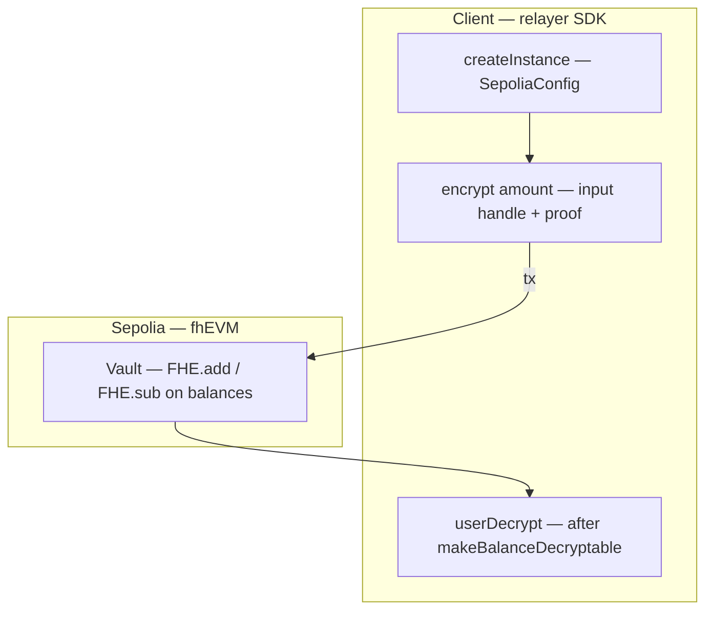
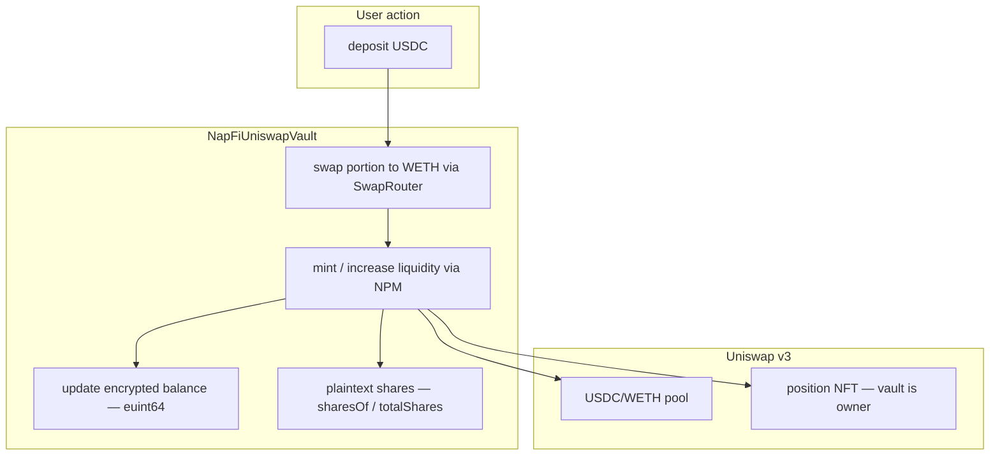
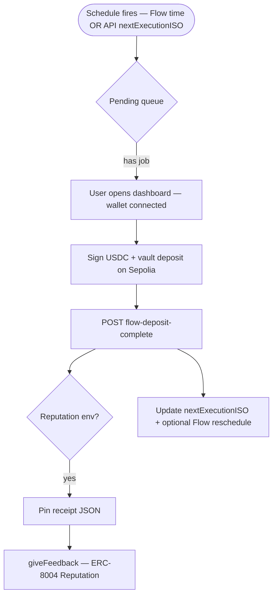

# NapFi — architecture, flows, and how to run

This document describes how **Flow (Cadence)**, **Ethereum Sepolia**, **Zama fhEVM**, **Uniswap v3**, and the **Express API** fit together, with **flowcharts** you can render in GitHub or any Mermaid-capable viewer.

---

## 1. High-level system context



**Roles in one sentence:** Flow **schedules** when something should happen; the API **queues** work and tracks goals; the user’s wallet (or operator) **signs** Sepolia transactions into a **Zama**-aware vault that may use **Uniswap v3** for liquidity; **ERC-8004** ties identity and reputation to the agent.

---

## 2. Onboarding and first schedule (no deposit yet)

After the user completes **`POST /api/setup`**, the backend may run **Cadence** transactions via FCL:

1. **`initHandler.cdc`** — save `AgentScheduler.Handler` under the Flow app account; publish capabilities.
2. **`scheduleDeposit.cdc`** — pay FLOW fees, schedule `executeTransaction` on the handler at `now + delay`.



---

## 3. Two ways a “deposit run” enters the queue

The server can enqueue a **pending USDC deposit** (same structure Flow would trigger) in two modes — see **`NAPFI_DEPOSIT_QUEUE_SOURCE`** in `server/.env.example`.

### 3a. Time-based queue (default: `time`)

When **`Date.now() >= nextExecutionISO`**, **`scheduleTimeDepositQueue.ts`** enqueues one pending item per due user (if none already pending). **No Flow event is required** for enqueueing in this mode.



### 3b. Chain-based queue (`chain`)

**`flowListener.ts`** polls Flow Access API for **`AgentScheduler.DepositTriggered`**. When **`depositQueueSource` allows chain enqueue**, a matching event **enqueues** the same pending structure.



**Note:** If mode is **`time`**, the listener may still **log** `DepositTriggered` but **does not** enqueue from chain (see comments in `flowListener.ts`).

---

## 4. Dashboard → Sepolia: pending deposit completion

The queue only holds **intent**. The **user wallet** approves/spends **USDC** and calls the vault — same path as a manual **Deposit** on the dashboard.



---

## 5. Zama fhEVM in this stack

**What it does:** User **balances** in the vault are represented as **FHE ciphertext handles** (`euint64` style) on-chain. Outsiders see ciphertext, not cleartext balances.

**Contract surface (mirrors `EncryptedVault` patterns):** `balanceOf` / `getBalanceHandle`, `hasBalance`, `makeBalanceDecryptable`, `deposit` / `withdraw` with **external ciphertext + input proof** from the Zama relayer SDK.

**Where it runs:** **Ethereum Sepolia** with Zama’s **fhEVM** coprocessor configuration (see `@fhevm/solidity` / `ZamaEthereumConfig` in contracts).



**Dual accounting in `NapFiUniswapVault`:** Uniswap **NPM** needs **plaintext** token amounts for `mint` / `increaseLiquidity` / `collect`. The contract therefore keeps **plaintext shares** (`totalShares`, `sharesOf`) for LP math **and** **encrypted per-user balances** for the confidential UX aligned with Zama.

---

## 6. Uniswap v3 in `NapFiUniswapVault`

**Goal:** Aggregate user USDC, swap part to **WETH**, provide **USDC/WETH** liquidity in a **v3** pool, hold the **position NFT**, route swap fees / liquidity through the vault logic.

**On-chain dependencies (Sepolia constants — `UniswapV3SepoliaConstants.sol`):**

| Component | Role |
|-----------|------|
| **UniswapV3Factory** | `getPool(token0, token1, fee)` |
| **NonfungiblePositionManager** | `mint`, `increaseLiquidity`, `decreaseLiquidity`, `collect` — ERC-721 position |
| **SwapRouter02** | `exactInputSingle` — USDC → WETH for liquidity skew |
| **WETH9** | Wrapped ETH on Sepolia |
| **USDC** | Circle test USDC address |

**Typical fee tier:** **0.3% (3000)** for USDC/WETH test pools.



---

## 7. Flow Cadence side (summary)

| Artifact | Purpose |
|----------|---------|
| **`AgentScheduler.cdc`** | `TransactionHandler` — on schedule, **`executeTransaction`** emits **`DepositTriggered(userEVMAddress, amount, timestamp, executionId)`**. |
| **`initHandler.cdc`** | Install handler resource + capabilities once per Flow account. |
| **`scheduleDeposit.cdc`** | Create scheduler manager if needed, pay FLOW fee, **`schedule`** next fire time. |
| **`getScheduledJobs.cdc`** | Read scheduled job ids from public manager capability. |

**Server wiring:** **`flowScheduler.ts`** submits Cadence; **`flowListener.ts`** polls events (HTTP range polling — avoids WS crash on TLS reset).

---

## 8. End-to-end “automation tick” (conceptual)



---

## 9. How to start the server and the app

### 9.1 Prerequisites

- **Node.js** ≥ 20  
- **Sepolia** RPC and funded wallet keys as in **`server/.env.example`**  
- Optional: **Flow** testnet account with FLOW; **IPFS** key (Lighthouse or Pinata)  
- Frontend: **`NEXT_PUBLIC_API_BASE_URL`** pointing at the API  

### 9.2 API (Express)

```bash
cd server
cp .env.example .env
# Edit .env — at minimum SEPOLIA_RPC_URL, BACKEND_PRIVATE_KEY, CORS_ORIGIN,
# and either LIGHTHOUSE_API_KEY or PINATA_JWT for first-time setup.
npm install
npm run dev
```

Default listen: **`http://localhost:3001`**. Check **`GET http://localhost:3001/health`**.

### 9.3 Frontend (Next.js)

```bash
cd frontend
# Create .env.local with NEXT_PUBLIC_API_BASE_URL=http://localhost:3001
npm install
npm run dev
```

Open **`http://localhost:3000`** (or `127.0.0.1` — ensure CORS includes that origin).

### 9.4 Optional: Flow scheduling

Set **`FLOW_ACCESS_NODE`**, **`FLOW_ACCOUNT_ADDRESS`**, **`FLOW_PRIVATE_KEY`**, **`FLOW_KEY_INDEX`**, **`AGENT_SCHEDULER_ADDRESS`** to match your deployed **`AgentScheduler`** on Flow testnet (see **`flow.json`** / **`cadence/README.md`**).

---

## 10. Related files

| Topic | Location |
|-------|----------|
| API routes | `server/src/index.ts` |
| Flow poll listener | `server/src/lib/flowListener.ts` |
| Time-based enqueue | `server/src/lib/scheduleTimeDepositQueue.ts` |
| Cadence send | `server/src/lib/flowScheduler.ts` |
| Uniswap + FHE vault | `onchain/contracts/uniswap/NapFiUniswapVault.sol` |
| Sepolia Uniswap constants | `onchain/contracts/uniswap/UniswapV3SepoliaConstants.sol` |
| Flow contracts | `cadence/contracts/AgentScheduler.cdc` |
| Addresses | `contracts.json`, `frontend/lib/contract-defs.ts` |

---

*Diagrams use [Mermaid](https://mermaid.js.org/). If a renderer fails, paste the fenced blocks into [mermaid.live](https://mermaid.live).*
